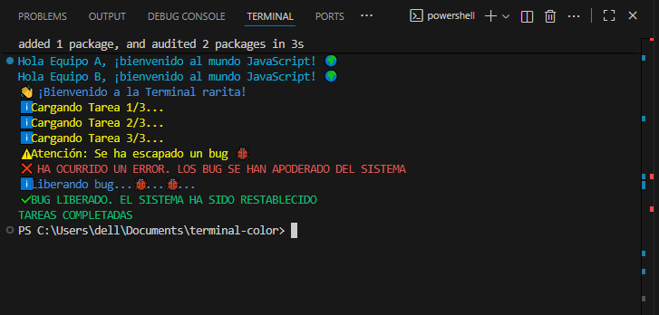

## 📟 La Terminal

Este proyecto consiste en crear un pequeño programa en **Node.js** que muestra mensajes en la consola usando la librería ` chalk` .
El propósito es practicar el trabajo con ramas, resolver conflictos, y usar consola con formatos y colores.

### 🧩 ¿Qué hace el programa?

El script llamado *“La Terminal”*:

✅ Saluda al usuario
⚠️ Muestra advertencias simuladas
❌ Simula mensajes de error
🎨 Utilizando colores y estilos con chalk

Cada tipo de mensaje se diferencia visualmente gracias a chalk.

### 🔀 Trabajo en Equipo

El trabajo se dividió en dos ramas:

| Equipo | Rama | Aporte |
|--------|------|--------|
| **A** | `grupo-a` | Mensajes de estado (saludo e información positiva) |
| **B** | `grupo-b` | Simulación de errores y advertencias |

Posteriormente, ambas ramas fueron unidas en la rama principal:` main` 


Durante este proceso se identificaron y resolvieron conflictos de Git combinando los cambios de ambos equipos.

---

## 🚀 Instalación y ejecución

1️⃣ Instalar dependencias  
```bash
npm install (chalk)
```
## 🧰 Tecnologías utilizadas

- Node.js

- Chalk para colores y estilos en consola

- Git & GitHub para colaboración en equipo
  
- Visual Studio Code para la ejecucion y escritura del codigo.

📸 Captura de la consola

>Aquí se mostrará una captura o evidencia del resultado en la consola (información, advertencias y errores con color).



## 🧠 Reflexión del Trabajo

### ¿Por qué es importante separar el trabajo en ramas?
- Permite trabajar en equipo sin afectar el código principal.
- Se pueden probar nuevas funciones sin romper el proyecto.
- Facilita identificar quién hizo cada cambio.
- Ayuda a resolver conflictos antes del merge.

---

### ¿Qué diferencia hay entre `console.log`, `console.info`, `console.warn` y `console.error`?

| Método             | Uso                          | Visualización |
|------------------|-----------------------------|--------------|
| `console.log()`  | Mensajes generales          | Normal       |
| `console.info()` | Información destacada       | Informativo  |
| `console.warn()` | Advertencias               | Amarillo ⚠️ |
| `console.error()`| Errores importantes        | Rojo ❌      |

---
¡Gracias por revisar! 🚀
